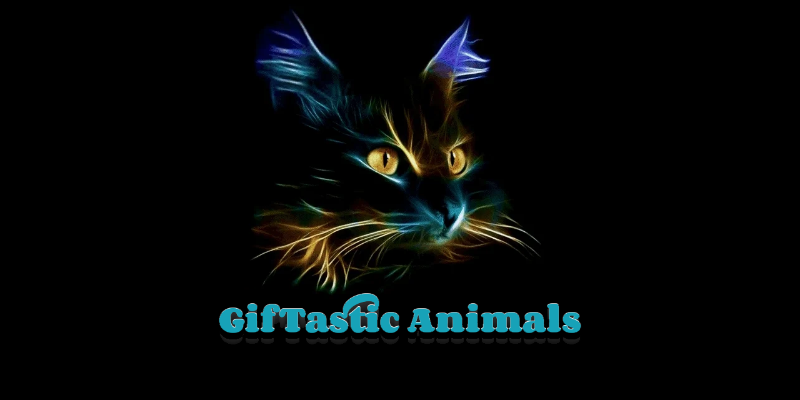

# GifTastic

### Overview

In this assignment, you'll use the GIPHY API to make a dynamic web page that populates with gifs of your choice. To finish this task, you must call the GIPHY API and use JavaScript and jQuery to change the HTML of your site.

### Achieved Bonus Goals

* Mobile responsive
* "Load more" functionality
* "Add to favorites"
* "Remove from favorites"
* Additional metadata (clicable titles)

### Instructions

1. Before you can make any part of your site work, you need to create an array of strings, each one related to a topic that interests you. Save it to a variable called topics.
    1. We chose animals for our theme, but you can make a list to your own liking.

1. Your app should take the topics in this array and create buttons in your HTML.
    1. Try using a loop that appends a button for each string in the array.

1. When the user clicks on a button, the page should grab 10 static, non-animated gif images from the GIPHY API and place them on the page.

1. When the user clicks one of the still GIPHY images, the gif should animate. If the user clicks the gif again, it should stop playing.

1. Under every gif, display its rating (PG, G, so on).
    1. This data is provided by the GIPHY API.
    1. Only once you get images displaying with button presses should you move on to the next step.

1. Add a form to your page that takes a value from a user input box and adds it to your topics array. Then make a function call that takes each topic in the array and remakes the buttons on the page.

1. Deploy your assignment to Github Pages.
1. Rejoice! You just made something really cool.

---

**[Playable Demo](https://malinkamell.github.io/GifTastic/)**

---

**Optimized for 1920x1080 screen resolution and Google Chrome Version 77.0.3865.75**

_Made for UOA Bootcamp, September 2019_